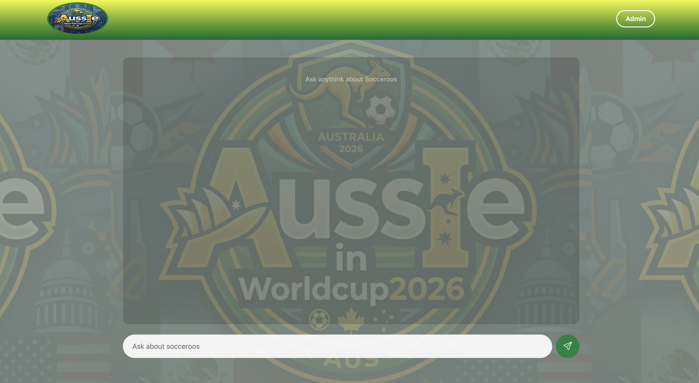
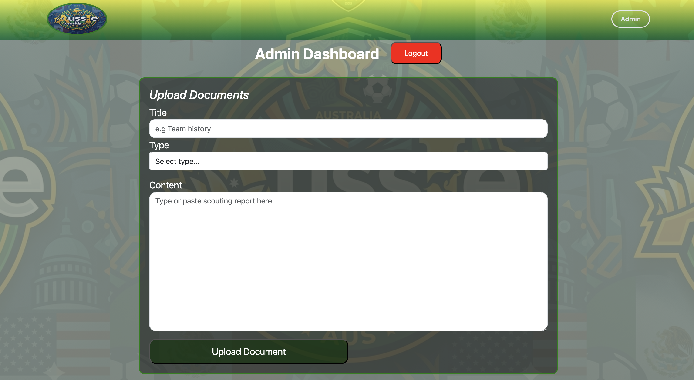

# 🦘 AussIe In WorldCup

An AI-powered RAG (Retrieval-Augmented Generation) chatbot about the Australian Socceroos at the 2026 FIFA World Cup. Ask anything about the squad, fixtures, history, tactics, and opponents — and get accurate, context-aware answers powered by real data.




---

## 🚀 Live Demo

[AssIe In Worldcup](https://aussie-in-worldcup.vercel.app/)

---

## 📖 What Is RAG?

RAG (Retrieval-Augmented Generation) is an AI architecture that combines a vector search engine with a large language model. Instead of relying solely on the model's training data, the app:

1. Converts your question into a vector embedding
2. Searches a vector database for the most relevant content chunks
3. Passes those chunks as context to the LLM
4. Returns a grounded, accurate answer based on real data

This means the chatbot only answers from the Socceroos content that has been ingested — no hallucinations, no guessing.

---

## ✨ Features

- 💬 AI chatbot powered by Claude API (Anthropic)
- 🔍 Semantic vector search via LanceDB
- 📄 Document ingestion with paragraph-based sliding window chunking
- 🗄️ MongoDB for document metadata storage
- 🔐 Password-protected admin panel for uploading and deleting documents
- 🗑️ Synced deletion — removing a document clears it from both MongoDB and LanceDB
- 📱 Responsive design for mobile and desktop
- ✍️ Markdown rendering for AI responses

---

## 🛠️ Tech Stack

### Frontend

- React (Vite)
- Bootstrap 5 + custom CSS
- react-markdown
- Axios

### Backend

- Node.js + Express
- MongoDB + Mongoose
- LanceDB (local vector database)
- OpenAI Embeddings (`text-embedding-3-small`)
- Anthropic Claude API (generation + reranking)

### Deployment

- Frontend → Vercel
- Backend → Railway

---

## 🏗️ Architecture

```
User Query
    │
    ▼
Generate Embedding (OpenAI)
    │
    ▼
Vector Search (LanceDB) ──── Cosine Similarity ──── Top K Chunks
    │
    ▼
Rerank Chunks (Claude API)
    │
    ▼
Generate Response (Claude API)
    │
    ▼
Return Answer + Sources
```

### Chunking Strategy

Documents are split using a **paragraph-based sliding window chunker** — each chunk preserves paragraph boundaries for better semantic coherence. Chunk size is approximately 400 characters.

### Similarity Scoring

LanceDB returns cosine distances which are converted to similarity scores using `1 - distance`. A configurable threshold filters out low-relevance chunks before passing them to the LLM.

---

## ⚙️ Environment Variables

Create a `.env` file in the root of your backend:

```env
PORT=8000
MONGODB_URI=your_mongodb_connection_string
OPENAI_API_KEY=your_openai_api_key
ANTHROPIC_API_KEY=your_anthropic_api_key
ADMIN_PASSWORD=your_admin_password
TOP_K=20
MIN_SIMILARITY=0.35
```

---

## 🖥️ Running Locally

### Prerequisites

- Node.js v18+
- MongoDB (local or Atlas)
- OpenAI API key
- Anthropic API key

### Backend

```bash
cd server
yarn install
node --env-file=.env index.js
```

Server runs on `http://localhost:8000`

### Frontend

```bash
cd client
yarn install
yarn dev
```

Frontend runs on `http://localhost:5173`

---

## 🔐 Admin Panel

The admin panel allows you to upload and manage documents that power the chatbot.

**Access:** Click the **Admin** button in the navbar and enter your admin password.

**Upload a document:**

- Enter a title, select a type (player, team, match, history, etc.), and paste the content
- The document is stored in MongoDB and automatically chunked and embedded into LanceDB

**Delete a document:**

- Click the delete button next to any document
- This removes it from both MongoDB and LanceDB simultaneously

---

## 📁 Project Structure

```
├── client/                  # React frontend
│   ├── src/
│   │   ├── components/      # Chatbox, AdminPanel, Navbar
│   │   ├── api/             # axios.js — API calls
│   │   └── App.css          # Global styles
│
├── server/                  # Express backend
│   ├── models/              # Mongoose schemas
│   ├── routes/              # API routes
│   ├── services/            # RAG pipeline, vector store
│   ├── middleware/          # Admin auth
│   └── index.js             # Entry point
```

---

## 🌏 About the Socceroos at 2026

Australia are competing in **Group D** of the 2026 FIFA World Cup alongside co-hosts USA, Turkey, and Paraguay. Under new head coach **Tony Popovic**, the squad features 17 first-time World Cup participants alongside veterans like Mat Ryan, Mathew Leckie, and Jackson Irvine.

## 👨‍💻 Author

**Brazesh Guragain**  
Full Stack Developer | Master of Technology in Software Engineering  
[brazeshguragain.com](https://brazeshguragain.com) · [LinkedIn](https://www.linkedin.com/in/brazesh-guragain-32a6661b0/) · [GitHub](https://github.com/bguragain1023-web)

---

## 📄 License

MIT
